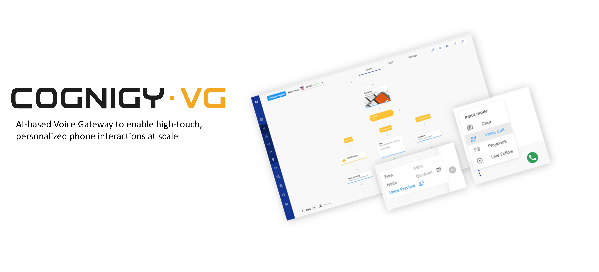

# Cognigy VoiceGateway Helm Chart

[Cognigy.AI](https://www.cognigy.com/) is an Enterprise Conversational Automation Platform for building advanced, integrated Conversational Automation Solutions through the use of cognitive bots.

This chart installs a Cognigy VoiceGateway deployment on a [Kubernetes](https://kubernetes.io/) cluster using the [Helm](https://helm.sh/) package manager.

## Prerequisites
- Kubernetes v1.23-1.26 running on AWS EKS, GCP GKE or Azure AKS 
- [kubectl utility](https://kubernetes.io/docs/tasks/tools/install-kubectl-linux/) installed on Linux or MacOS client and connected to the cluster. **Windows clients are not supported by this installation guide.**
- [Helm](https://helm.sh/docs/intro/install/) v3.9.0+ installed locally 

## Configuration

Provision a managed kubernetes provider following one of the following guides:
- [AWS EKS Cluster Setup](docs/aws-eks-cluster-setup.md)
- [GCP GKE Cluster Setup](docs/gcp-gke-cluster-setup.md)

### Release Values

To deploy a new Cognigy VoiceGateway setup you need to create a separate file with Helm release values. You can use `values_prod.yaml` as a baseline, we recommend to start with it:

1. Make a copy of `values_prod.yaml` into a new file and name it accordingly, we refer to it as `YOUR_VALUES_FILE.yaml` later in this document.
2. **Do not make** a copy of default `values.yaml` file as it contains hardcoded docker images references for all microservices, and in this case you will need to change all of them manually during upgrades. However, you can add some variables from default `values.yaml` file into your customized `YOUR_VALUES_FILE.yaml` later on, e.g. for tweaking CPU/RAM resources of Cognigy VoiceGateway microservices. We describe this process later in the document.

### Setting Essential Parameters

You need to set at least following parameters in `YOUR_VALUES_FILE.yaml`:

1. Cognigy.AI Image repository credentials: set `imageCredentials.username` and `imageCredentials.password` accordingly.
2. Cloud Provider: set `cloud` variable accordingly.

### Cognigy.VG DNS and TLS Settings

Cognigy VoiceGateway exposes three web services for which you will need to assign DNS records in a public domain operated by your organization. These DNS records must be added into your DNS system during the installation process. Replace `yourdomain.com` according to the domain (subdomain) of your organization under `ingress` section as below:

```
ingress:
  api:
    host: "voicegateway-api.yourdomain.com"
  testCallManager:
    host: "voicegateway-test-call-manager.yourdomain.com"
  webapp:
    host: "voicegateway-web.yourdomain.com"
```

Cognigy VoiceGateway relies on SSL-encrypted connection between the client and the services. You need to provide an SSL certificate for the domain in which DNS records for Cognigy VoiceGateway will be created, for this put the SSL certificate under `tls.crt` and its private key under `tls.key`. If you have a certificate chain, make sure you provide the whole certificate chain under `tls.crt` in [.pem format](https://www.digicert.com/kb/ssl-support/pem-ssl-creation.htm).

**Note: Make sure you install a publicly trusted TLS certificate signed by a Certificate Authority. Although using of self-signed certificates is possible in test environments, Cognigy does not recommend usage of self-signed certificates, does not guarantee full compatibility with our products and will not support such installations.**

### Installing the Chart

1. Download dependencies:

```
helm dependency update
```

2. Install Cognigy VoiceGateway Helm release:

- Installing from Cognigy Container Registry (recommended), specify proper `HELM_CHART_VERSION` and `YOUR_VALUES_FILE.yaml`:
  - Login into Cognigy helm registry (provide your Cognigy Container Registry credentials):
  ```
  helm registry login cognigy.azurecr.io \
   --username <your-username> \
   --password <your-password>
  ```
  - Install Helm Chart into a separate `voicegateway` namespace:
  ```
  helm upgrade --install --namespace voicegateway voicegateway oci://cognigy.azurecr.io/helm/voicegateway --version HELM_CHART_VERSION --values YOUR_VALUES_FILE.yaml --create-namespace
  ```
- Alternatively you can install it from the local chart (not recommended):
  ```
  helm upgrade --install --namespace voicegateway --values YOUR_VALUES_FILE.yaml voicegateway . --create-namespace
  ```

3. Verify that all pods are in a ready state:

```
kubectl get pods --namespace voicegateway
```
4. Get external IP/CNAME (EXTERNAL-IP) for DNS records of LoadBalancer Service for Traefik Ingress: 
```
kubectl get service -n=voicegateway traefik
```
5. Add DNS records provided in `YOUR_VALUES_FILE.yaml` into your DNS provider pointing to `EXTERNAL-IP` from the output of the previous command. 

Proceed with logging in into Cognigy VoiceGateway WebApp under: `voicegateway-web.yourdomain.com`

### Upgrading Helm Release

To upgrade Cognigy VoiceGateway platform to a newer version, you need to upgrade the existing Helm release to a particular `HELM_CHART_VERSION`, for this execute:

```bash
helm upgrade --namespace voicegateway voicegateway oci://cognigy.azurecr.io/helm/voicegateway --version HELM_CHART_VERSION --values YOUR_VALUES_FILE.yaml
```

### Cognigy VoiceGateway WebApp Login

To log in for the first time, use the following credentials: username: `admin`, password: `admin`.
After the first login, you will be forced to change the password, choose a safe one and store it in a secure place.

### Enable Interaction Panel Calls
1. Create, in the Cognigy VoiceGateway WebApp, a new Service Provider (e.g.: `InteractionPanelCallManager`) and save the ID
2. Create an API Key for your new Service Provider and save the Token
3. In `YOUR_VALUES_FILE.yaml` set `testCallManager.enabled` to `true` and add the information into `testCallManager.interactionPanelServiceProvider`
4. Execute Helm Upgrade


### Modifying Resources

Default resources for Cognigy.AI microservices specified in `values.yaml` are tailored to provide consistent performance for typical production use-cases. However, to meet particular demands, you can modify RAM/CPU resources or number of replicas for separate microservices in your Cognigy.AI installation. For this you need to copy specific variables from default `values.yaml` into `YOUR_VALUES_FILE.yaml` for a particular microservice and adjust the `Request/Limits` and `replicaCount` values accordingly.

**IMPORTANT:** Do not copy `image` value as you will need to modify it manually during upgrades!

For example, for `feature-server` microservice copy from `values.yaml` and adjust in `YOUR_VALUES_FILE.yaml` following variables:

```
feature-server:
  replicaCount: 3
  resources:
    requests:
      cpu: '3'
      memory: 2Gi
    limits:
      cpu: '4'
      memory: 3Gi
```

### Cognigy.VG Secrets Backup

During the installation process `dbinit-generate.sh` initialization script generates connection strings for Cognigy VoiceGateway microservices to Redis and stores these connection strings in form of [Kubernetes secrets](https://kubernetes.io/docs/concepts/configuration/secret/) in `voicegateway` installation namespace. In case you loose the cluster where Cognigy VoiceGateway is running or accidentally delete these secrets, there will be no possibility to connect to the existing databases anymore.

**Thus, it is crucial to make a consistent backup of the secrets in `voicegateway` namespace and to store them securely**. Execute this [script](scripts/backup_voicegateway_secrets.sh) to perform a backup of secrets. Store the folder with the secrets securely as it contains sensitive data.

### Uninstalling the Release

**IMPORTANT:** If you uninstall the Cognigy VoiceGateway Helm release, `traefik` Ingress deployment will also be removed. Consequently, a dynamically provisioned `External IP` of the cloud provider's load balancer (e.g. ELB on AWS) will also be freed up. It will affect static DNS settings configured during DNS setup and will cause a downtime of your installation. If you recreate a release you will also have to update DNS, make sure DNS timeouts are set properly, to avoid long outages.

To uninstall a release execute:

```
helm uninstall --namespace voicegateway voicegateway
```

### Clean-up

Please keep in mind that Persistent Volume Claims (PVC) and Secrets are not removed when you delete the Helm release. However, please also keep in mind that:

- All data will be lost if PVCs are cleaned up

To fully remove PVCs and secrets you need to run the following command:

**IMPORTANT: If you run these commands, all data persisted in PVCs will be lost!**

**IMPORTANT: If you run these commands, all credentials will be lost!**

```
kubectl delete --namespace voicegateway pvc --all
kubectl delete --namespace voicegateway secrets --all
```
