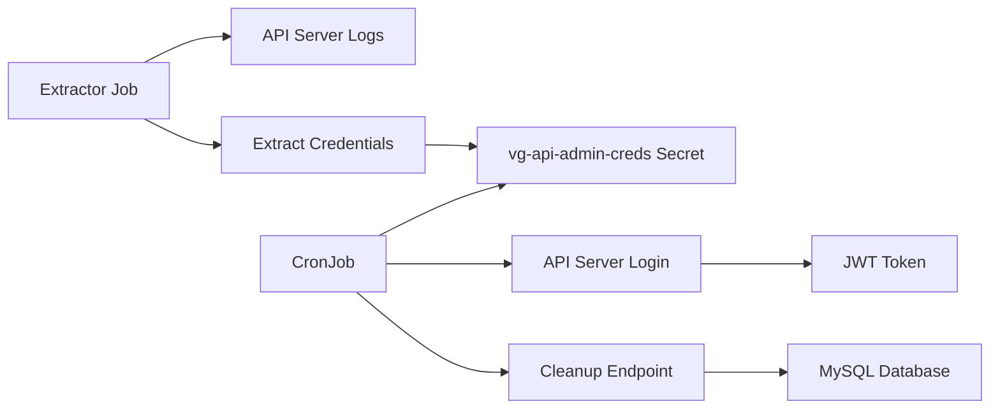

# Audit Logs Cleanup CronJob

This document explains how to configure and use the simplified audit logs cleanup CronJob in the VoiceGateway Helm chart.

## 🎯 Overview

The audit logs cleanup CronJob automatically removes old audit log records by calling the `DELETE /v1/AuditLogs/cleanup` endpoint on the jambonz-api-server. The implementation is designed for **simplicity and reliability**.

### ✨ Key Features

- ✅ **Zero-configuration setup** - works out of the box
- ✅ **Reuses existing infrastructure** - leverages VG interaction panel credentials
- ✅ **Daily automatic cleanup** - maintains optimal database performance  
- ✅ **Robust error handling** - detailed logging and status reporting
- ✅ **Customizable scheduling** - flexible cron expressions
- ✅ **Production-ready** - minimal maintenance required

## 🚀 Quick Start

### Basic Setup (Recommended)

The simplest way to enable audit logs cleanup:

```yaml
# values.yaml
auditLogging:
  enabled: true
```

That's it! The audit system will:
- ✅ Enable audit logging in the API server
- ✅ Automatically enable cleanup CronJob
- ✅ Run daily at 2 AM UTC
- ✅ Auto-generate admin credentials
- ✅ Clean up old audit logs automatically
- ✅ Provide detailed logging

### Custom Schedule

```yaml
# values.yaml
auditLogging:
  enabled: true
  cleanup:
    schedule: "0 3 * * *"  # Run at 3 AM instead
```

## ⚙️ Configuration Options

| Parameter | Description | Default | Required |
|-----------|-------------|---------|----------|
| `auditLogging.enabled` | Enable audit logging and cleanup | `false` | ✅ |
| `auditLogging.cleanup.schedule` | Cron schedule expression | `"0 2 * * *"` | ❌ |
| `auditLogging.cleanup.ttlDays` | Days to keep audit logs | `30` | ❌ |
| `auditLogging.cleanup.ttlSecondsAfterFinished` | Job cleanup time | `180` | ❌ |
| `auditLogging.cleanup.extractorImage` | Credentials extractor image | `"bitnami/kubectl:latest"` | ❌ |
| `auditLogging.cleanup.extractorMaxRetries` | Max password extraction retries | `15` | ❌ |
| `auditLogging.cleanup.extractorRetryInterval` | Retry interval in seconds | `20` | ❌ |

### Complete Configuration Example

```yaml
auditLogging:
  ## Enable audit logging and cleanup
  enabled: true
  
  cleanup:
    ## Cron schedule for audit logs cleanup (daily at 2 AM)
    schedule: "0 2 * * *"
    
    ## Days to keep audit logs (used by API server)
    ttlDays: 30
    
    ## Time in seconds after finished job to keep for debugging
    ttlSecondsAfterFinished: 180
    
    ## Credentials extractor configuration
    extractorImage: "bitnami/kubectl:latest"
    extractorMaxRetries: 15
    extractorRetryInterval: 20
```

## 🔧 How It Works

### Architecture



### Execution Flow

**Initial Setup (Post-Install/Upgrade):**
1. **Extractor Job triggers** after Helm deployment
2. **Cleans existing admin users** from MySQL database
3. **Restarts API server** to force fresh credential creation
4. **Monitors API server logs** for new admin passwords
5. **Creates vg-api-admin-creds secret** with extracted credentials

**Daily Cleanup:**
1. **CronJob triggers** according to schedule
2. **Retrieves admin credentials** from `vg-api-admin-creds` secret
3. **Logs in to API server** using username/password
4. **Gets JWT token** from login response
5. **Sends DELETE request** to `/v1/AuditLogs/cleanup` with JWT
6. **Logs results** with detailed status information
7. **Cleans up** after 180 seconds

### Authentication

The system uses JWT-based authentication with auto-generated credentials:
```yaml
secret: vg-api-admin-creds
keys: 
  - username  # cognigy-ai
  - password  # auto-extracted from API server logs
```

This secret is **automatically created** during deployment, ensuring zero-configuration setup.

## 📋 Cron Schedule Examples

```yaml
# Daily at 2 AM (default)
schedule: "0 2 * * *"

# Daily at 3:30 AM
schedule: "30 3 * * *"

# Every Sunday at 1 AM
schedule: "0 1 * * 0"

# Every 12 hours
schedule: "0 */12 * * *"

# Weekdays only at 2 AM
schedule: "0 2 * * 1-5"

# First day of month at 2 AM
schedule: "0 2 1 * *"
```

## 🔍 Monitoring and Troubleshooting

### Check CronJob Status

```bash
# View CronJob configuration
kubectl get cronjob audit-logs-cleanup -n voicegateway

# Check CronJob details
kubectl describe cronjob audit-logs-cleanup -n voicegateway

# List recent job executions
kubectl get jobs -n voicegateway | grep audit-logs-cleanup

# View logs from latest job
kubectl logs job/$(kubectl get jobs -n voicegateway -o name | grep audit-logs-cleanup | head -1 | cut -d/ -f2) -n voicegateway
```

### Successful Execution Example

```
Starting audit log cleanup...
API URL: https://api-vg.yourdomain.com/v1/AuditLogs/cleanup
Timestamp: Mon Jan 15 02:00:01 UTC 2024
HTTP Status Code: 200
Response Body: {"status":"success","deleted_count":127,"message":"Audit logs cleaned successfully"}
✅ Audit log cleanup completed successfully
Deleted records: 127
```

### Common Issues and Solutions

#### ❌ **Authentication Failed (401)**
```
HTTP Status Code: 401
Response Body: {"error":"Unauthorized"}
❌ Audit log cleanup failed
```

**Solution:**
1. Verify the admin credentials secret exists:
   ```bash
   kubectl get secret vg-api-admin-creds -n voicegateway
   ```
2. Check the credentials in the secret:
   ```bash
   kubectl get secret vg-api-admin-creds -n voicegateway -o jsonpath='{.data.username}' | base64 -d
   kubectl get secret vg-api-admin-creds -n voicegateway -o jsonpath='{.data.password}' | base64 -d
   ```
3. If the secret doesn't exist, check the extractor job logs:
   ```bash
   kubectl logs -l app=audit-cleanup,component=extractor -n voicegateway
   ```

#### ❌ **Connection Failed**
```
curl: (7) Failed to connect to api-vg.yourdomain.com port 443: Connection refused
❌ Audit log cleanup failed
```

**Solution:**
1. Verify API server is running:
   ```bash
   kubectl get pods -n voicegateway | grep api-server
   ```
2. Check ingress configuration:
   ```bash
   kubectl get ingress -n voicegateway
   ```
3. Test DNS resolution from within cluster:
   ```bash
   kubectl run test-pod --rm -i --tty --image=alpine -- nslookup api-vg.yourdomain.com
   ```

#### ❌ **Insufficient Privileges (403)**
```
HTTP Status Code: 403
Response Body: {"error":"Admin privileges required"}
❌ Audit log cleanup failed
```

**Solution:**
Ensure the API key in the secret has admin privileges in the jambonz database.

## 🛠️ Manual Testing

### Run Manual Cleanup

```bash
# Create a one-time job from the CronJob
kubectl create job manual-audit-cleanup-$(date +%s) \
  --from=cronjob/audit-logs-cleanup \
  -n voicegateway

# Watch the job execute
kubectl get jobs -n voicegateway -w

# View logs
kubectl logs job/manual-audit-cleanup-XXXXX -n voicegateway
```

### Direct API Test

```bash
# Get the admin credentials
ADMIN_USER=$(kubectl get secret vg-api-admin-creds -n voicegateway -o jsonpath='{.data.username}' | base64 -d)
ADMIN_PASS=$(kubectl get secret vg-api-admin-creds -n voicegateway -o jsonpath='{.data.password}' | base64 -d)

# Login to get JWT token
JWT_TOKEN=$(curl -s -X POST https://api-vg.yourdomain.com/v1/Login \
  -H "Content-Type: application/json" \
  -d "{\"username\":\"$ADMIN_USER\",\"password\":\"$ADMIN_PASS\"}" | \
  grep -o '"token":"[^"]*"' | cut -d'"' -f4)

# Test the cleanup endpoint directly
curl -X DELETE https://api-vg.yourdomain.com/v1/AuditLogs/cleanup \
  -H "Authorization: Bearer $JWT_TOKEN" \
  -H "Content-Type: application/json" \
  -v
```

## 🔒 Security Considerations

- **🔐 Secure Secret Storage**: Admin credentials stored in Kubernetes Secret
- **🛡️ Minimal Permissions**: CronJob runs with least-privilege access
- **🔍 Audit Trail**: Cleanup operations are logged for accountability
- **🌐 Network Security**: Can be restricted with NetworkPolicies if needed

## 💡 Advanced Configuration

### Manual Credentials

If you need to manually manage credentials instead of automatic extraction, simply create the `vg-api-admin-creds` secret manually before enabling audit logging:

```bash
kubectl create secret generic vg-api-admin-creds \
  -n <namespace> \
  --from-literal=username='cognigy-ai' \
  --from-literal=password='your-password'
```

The system will automatically use the existing secret instead of creating a new one.

### Resource Limits

The CronJob uses minimal resources by default, but you can customize:

```yaml
# Not configurable via values.yaml in simplified version
# Resources are set to minimal requirements in the template
```

## 📊 Monitoring Integration

### Prometheus Metrics

The CronJob doesn't export Prometheus metrics directly, but you can monitor:

- Job success/failure rates via `kube_job_status_succeeded`
- Execution duration via `kube_job_status_completion_time`
- Pod resource usage via standard Kubernetes metrics

### Alerting Examples

```yaml
# Example Prometheus alert for failed cleanups
- alert: AuditCleanupJobFailed
  expr: kube_job_status_failed{job_name=~"audit-logs-cleanup.*"} > 0
  for: 5m
  labels:
    severity: warning
  annotations:
    summary: "Audit cleanup job failed"
    description: "The audit logs cleanup job has failed"
```

## 🎓 Best Practices

1. **✅ Monitor regularly**: Set up alerts for job failures
2. **✅ Test schedule**: Ensure cleanup runs during low-traffic periods
3. **✅ Verify retention**: Confirm audit logs are retained for required compliance periods
4. **✅ Check storage**: Monitor database size to ensure cleanup is effective
5. **✅ Update regularly**: Keep VoiceGateway updated for latest improvements

## 📞 Support

For issues or questions:

1. **Check job logs** first for detailed error information
2. **Verify configuration** matches this documentation
3. **Test connectivity** between CronJob and API server
4. **Review API server logs** for additional context

The simplified audit cleanup is designed to be **maintenance-free** and **reliable** for production environments.